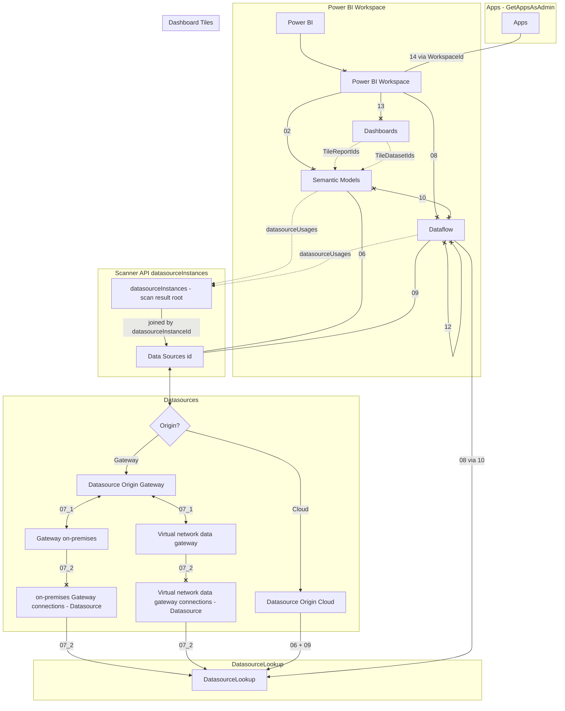

# Power BI Tenant Lens — The Power BI Solution

---

## Power BI Tenant Lens — Community Solution

This solution is provided as-is, as a community contribution. It has been developed iteratively against real-world tenants with up to 45,000+ workspaces and battle-tested through hundreds of hours of production runs. Every resilience pattern in the code traces back to an actual failure encountered and fixed.

That said, this is not a Microsoft product and comes with no warranty or support agreement. A few things to keep in mind:

Microsoft APIs change. The Scanner API, Admin APIs, and Fabric APIs evolve continuously. Endpoints may be deprecated, throttling limits adjusted, or response schemas modified without notice. What works today may need adaptation tomorrow.

Data completeness depends on permissions and API behavior. The inventory reflects what the APIs return for your service principal's scope. Gaps in tenant settings, datasource details, or lineage data may exist due to API limitations — some of which are known and documented, others yet to be discovered.

This is not a migration tool. It is an inventory and analysis foundation. The solution includes a semantic model that makes the inventory data immediately explorable in Power BI. Decisions about workspace consolidation, capacity planning, or artifact migration should be validated by your own governance processes and stakeholders. The data supports those decisions — it does not make them for you.

I maintain this solution because I believe in it, and I will continue to fix issues and add features as time permits. But "as time permits" is the operative phrase — this is community work, not a product with an SLA.

If you find issues or have ideas, I welcome the conversation. If you build something great on top of it, even better.

Tom Martens — Data Platform MVP

---

## Getting Started

This solution is distributed as a Power BI Template file (`.pbit`). The template contains all Power Query logic, the semantic model (relationships, calculated columns, measures), and report pages — but no data. On first use you provide your own parameter values and the template connects to your CSV exports.

### How to use the template

1. **Double-click** the `.pbit` file. Power BI Desktop opens and immediately presents a parameter dialog.
2. Enter values for the two required parameters:
   - **pq_par_TenantName** — an identifier for your Power BI tenant (e.g. `Contoso`). This value is added as a column to every table, useful when combining inventories from multiple tenants.
   - **pq_par_CSVFolderPath** — the full path to the folder containing the CSV files produced by `PowerBITenantLens.ps1` (e.g. `c:\temp\`). Include the trailing backslash.
3. Click **Load**. Power Query imports the latest CSV file per context from the specified folder.

If you need to change the parameter values later, go to **Transform data → Edit parameters** in the Power BI Desktop ribbon.

> **Prerequisites:** The CSV files must already exist in the target folder. Run `PowerBITenantLens.ps1` first — see the `PowerBITenantLens_Guide.md` for details.

---

## Purpose

This Power BI solution provides a comprehensive inventory of a Power BI / Microsoft Fabric tenant. It consumes CSV exports from the Scanner API and Admin APIs (produced by PowerShell scripts) and presents them in a single semantic model for analysis, migration planning, and governance.

> **Important: This inventory is not a replacement for Power BI solution documentation.** It captures metadata about artifacts (workspaces, reports, datasets, datasources, dataflows, dashboards, apps) — not the business logic, design decisions, or operational procedures behind them. Proper solution documentation (data models, transformation logic, refresh strategies, access policies, alert configurations) remains the responsibility of each solution owner. In particular, user-configured dashboard data alerts cannot be exported or re-created programmatically — they are silently lost during workspace migration. The inventory can identify which dashboards have alertable tiles (Card, KPI, Gauge via table 16_DashboardTiles), but it cannot capture the alert definitions themselves. Solution owners must document their alert configurations before migration.

---

## Architecture

```
PowerShell Script                  CSV Files                Power BI
─────────────────                 ─────────                 ────────
PowerBITenantLens.ps1  ──→  01–16 CSVs (17 tables)  ──→  Power Query
                                                            (import + transform)
                                                                 ↓
                                                           Semantic Model
                                                             (tables +
                                                              relationships +
                                                              calculated columns +
                                                              measures)
```

### Data Sources (CSV files)

| # | CSV Context | Source API | Description |
|---|-------------|-----------|-------------|
| 01 | TenantSettings | Scanner API | Fabric/Power BI tenant-level settings |
| 02 | Workspaces | Scanner API | Workspace inventory |
| 03 | WorkspaceMembers | Scanner API | Workspace membership and roles |
| 04 | Reports | Scanner API | Report inventory |
| 05 | SemanticModels | Scanner API | Semantic model (dataset) inventory |
| 06 | DataSources | Scanner API | Data source details per semantic model (fully populated since 2026-03-04 fix) |
| 07_1 | GatewayClusters | Gateway API | On-premises gateway cluster inventory |
| 07_2 | GatewayDatasources | Gateway API | Data sources registered on gateways |
| 08 | Dataflows | Scanner API | Dataflow inventory per workspace |
| 09 | DataflowDatasources | Scanner API | Data source details per dataflow |
| 10 | DatasetUpstreamDataflows | Scanner API | Lineage: which semantic models consume which dataflows |
| 11 | Refreshables | Admin Refreshables API | Refresh health, schedules, 7-day stats (dedicated capacity only) |
| 12 | DataflowUpstreamDataflows | Scanner API | Lineage: which dataflows consume which other dataflows |
| 13 | Dashboards | Scanner API | Dashboard inventory with tile summary and linked report/dataset IDs |
| 14 | Apps | Admin Apps API (GetAppsAsAdmin) | Published app inventory with workspace link |
| 15 | AppAccess | Admin Apps API (GetAppUsersAsAdmin) | Per-app access/permissions: principals, types, access rights |
| 16 | DashboardTiles | Admin Dashboard API (Tiles endpoint) | Per-tile detail: tile type, linked report/dataset, embed URL |

### Filename Convention

```
xx_Context_YYYY-MM-DD_hhmmss.csv
```

When multiple exports exist for the same context, only the **latest file** (by timestamp) is imported.
This might change at a given point in the future, so that certain development can be tracked over time, but this idea did not even make it to the backlog.

---

## Datasource Relationships

The following diagram shows how Power BI artifacts relate to datasources and how the inventory tables map to these relationships.



`DatasourceInstances` lives at the **root** of the Scanner API scan result, not nested per workspace. Datasets and dataflows reference datasources via `datasourceUsages[].datasourceInstanceId` which joins to `datasourceInstances[].datasourceId` at the root. This is a normalized lookup pattern — the same datasource can be used by multiple datasets across multiple workspaces.

Dashboards (table 13) come from the Scanner API scan result — no additional API calls. Tile-level report and dataset references are flattened into summary columns on the dashboard row. Apps (table 14) use a separate bulk endpoint (`GetAppsAsAdmin`) with simple pagination. DataflowUpstreamDataflows (table 12) captures dataflow-to-dataflow lineage from the `upstreamDataflows` property on dataflow objects in the scan result.

**Cardinality notation:** `--x` = one-to-many, `x--x` = many-to-many, `<-->` = one-to-one, `-.->` = logical reference (not a model relationship), `{Origin?}` = exclusive either/or (each datasource is Gateway or Cloud, never both).

---

## Power Query Layer

### Parameters

| Parameter | Description | Example |
|-----------|-------------|---------|
| `pq_par_TenantName` | Tenant name, added as column to every table | `Contoso` |
| `pq_par_CSVFolderPath` | Folder path to the CSV files | `C:\Users\...\Sample data\` |

### Helper Queries (do not load)

| Query | Purpose |
|-------|---------|
| `fnGetFolderPath` | Returns the CSV folder path from the parameter |
| `ValidFiles` | Scans folder, extracts context + timestamp, filters to 17 valid contexts, keeps latest file per context |

### Data Queries (load to model)
The number of rows are examples from my favorite tenant 😎

| Query | Rows (approx.) | Notes |
|-------|----------------|-------|
| `01_TenantSettings` | ~380 | Tenant-level feature flags |
| `02_Workspaces` | ~46,000 | All workspaces in tenant |
| `03_WorkspaceMembers` | ~300,000 | Users/groups/SPNs per workspace |
| `04_Reports` | ~75,000 | All reports with dataset link |
| `05_SemanticModels` | ~58,000 | All semantic models |
| `06_DataSources` | ~60,000 | Scanner API rows (now with full ConnectionDetails) + appended DatasetUpstreamDataflows rows |
| `07_1_GatewayClusters` | ~20 | Gateway cluster inventory |
| `07_2_GatewayDatasources` | ~1,800 | Gateway-registered datasources with FriendlyName |
| `08_Dataflows` | ~700 | Dataflow inventory |
| `09_DataflowDatasources` | ~3,400 | Dataflow datasource details |
| `10_DatasetUpstreamDataflows` | ~3,200 | Dataset-to-Dataflow lineage bridge |
| `11_Refreshables` | ~5,000 | Refresh schedules and health |
| `12_DataflowUpstreamDataflows` | ~100 | Dataflow-to-dataflow lineage (chained dataflows) |
| `13_Dashboards` | ~3,000 | Dashboard inventory with tile summary |
| `14_Apps` | ~500 | Published apps with workspace link |
| `15_AppAccess` | ~15,000 | Per-app access records (principals + access rights) |
| `16_DashboardTiles` | ~25,000 | Per-tile detail for all dashboards |
| `DatasourceLookup` | ~3,500 | Unified deduped lookup (load to model) |

### Key Design Decisions

**`06_DataSources` — Dataflow enrichment.** The Scanner API does not create datasource rows for datasets that source from dataflows. These datasets only appear in `10_DatasetUpstreamDataflows`. To ensure DISTINCTCOUNT of datasource types per semantic model includes "Dataflow" alongside Sql, File, Web, etc., the `06_DataSources` query appends rows from table 10 with:
- `DatasourceType` = "Dataflow"
- `DatasourceId` = `TargetDataflowId` (the dataflow's ID)
- `DataSource` = "DatasetUpstreamDataflows" (vs. "Scanner API" for original rows)

**`DatasourceLookup` — Unified deduplication.** Multiple datasource tables have overlapping and duplicate `DatasourceId` values. A single lookup table avoids circular dependency errors in DAX and enables fast `RELATED()` lookups. Since the 2026-03-04 fix, tables 06 and 09 now contain full datasource details (DatasourceType, ConnectionDetails, etc.) directly from the Scanner API. The DatasourceLookup merges: Gateway datasources (07_2), cloud datasources from 06 (non-gateway, non-dataflow), dataflow-consumed datasources from 09, and dataflows-as-datasources (08 via 10). Priority: Gateway > Cloud (06) > Dataflow DS (09) > Dataflow (08). A source (`08_Dataflows`) provides FriendlyName for dataflow-as-datasource entries (format: `"DataflowName (WorkspaceName)"`).

**`DatasourceLookup` — Datasource category for table 09.** Datasources in `09_DataflowDatasources` are regular datasources (SharePoint, SQL Server, etc.) *consumed by* dataflows — not dataflows themselves. They receive a default `DatasourceCategory = "Cloud"` in the M code, but this is only a starting label. If the same DatasourceId also appears in 07_2 (gateway-registered), the deduplication priority (Gateway > Cloud) ensures it ends up as `"Gateway"` in the final DatasourceLookup. For example, a dataflow reading from an on-premises SQL Server has `DatasourceType = "Sql"` in table 09 and is correctly categorized as `"Gateway"` through 07_2. Only datasources from `10_DatasetUpstreamDataflows` (via `08_Dataflows`) represent dataflows *acting as* datasources, and these receive `DatasourceCategory = "Dataflow"`.

**`DatasourceLookup` — Empty string cleanup.** The `09_DataflowDatasources` CSV exports empty `DatasourceType` fields as empty strings (`""`) rather than null. Power BI treats `""` and `null` differently — `ISBLANK()` returns FALSE for empty strings, and visuals render them as a separate unlabeled category alongside "(Blank)". The `DatasourceLookup` query includes a `Table.ReplaceValue` step after deduplication to convert empty strings to null in `DatasourceType`:

```m
CleanedType = Table.ReplaceValue(Deduplicated, "", null, Replacer.ReplaceValue, {"DatasourceType"})
```

**`07_2_GatewayDatasources` — FriendlyName extraction.** The Power Query step parses the double-encoded `ConnectionDetails` JSON and extracts the first value (typically Server, URL, or Path) as a human-readable `FriendlyName` column.

**Empty-table resilience (HasData / EmptyTable / Result pattern).** Ten of the 17 tables represent optional data — their CSV files may be absent because the tenant has no artifacts of that type, or because a long-running step (15 or 16) hasn't been executed yet. Without a guard, `Filtered{0}[Content]` throws an error when the table `Filtered` is empty (no matching CSV file).

The fix wraps the CSV-parsing logic in a three-step guard:

```m
HasData    = not Table.IsEmpty(Filtered),
EmptyTable = Table.FromRecords({}, type table [ col1=text, col2=text, ... ]),
Result     = if not HasData then EmptyTable else
    let
        CSV = Csv.Document(Filtered{0}[Content], ...),
        ...
    in AddTenantName
```

When the CSV is absent, the table loads as a properly typed empty table — zero rows, correct schema, relationships intact. Power BI won't complain, DAX measures return 0 or BLANK gracefully, and visuals just show "no data."

**Cascade dependencies.** Some child tables are meaningless when their parent table is empty — for example, `16_DashboardTiles` has no useful data if `13_Dashboards` is absent. These tables check both their own CSV and their parent's CSV before loading:

```m
Filtered   = Table.SelectRows(Source, each [Context] = "16_DashboardTiles"),
Filtered13 = Table.SelectRows(Source, each [Context] = "13_Dashboards"),
HasData    = not Table.IsEmpty(Filtered) and not Table.IsEmpty(Filtered13),
```

The full dependency map:

| Table | Absent when... | Cascade parent |
|-------|---------------|----------------|
| 07_1_GatewayClusters | No on-premises gateways | — |
| 07_2_GatewayDatasources | No on-premises gateways | — |
| 08_Dataflows | No dataflows in tenant | — |
| 09_DataflowDatasources | No dataflows | — |
| 10_DatasetUpstreamDataflows | No own CSV **or** no 08_Dataflows CSV | 08_Dataflows |
| 12_DataflowUpstreamDataflows | No own CSV **or** no 08_Dataflows CSV | 08_Dataflows |
| 13_Dashboards | No dashboards | — |
| 14_Apps | No published apps | — |
| 15_AppAccess | No own CSV **or** no 14_Apps CSV | 14_Apps |
| 16_DashboardTiles | No own CSV **or** no 13_Dashboards CSV | 13_Dashboards |

---

## Semantic Model

### Calculated Table: `dim Tenant`

A calculated dimension table derived from `01_TenantSettings`, providing a single `TenantName` column for cross-table filtering.

```dax
dim Tenant = DISTINCT( ALLNOBLANKROW( '01_TenantSettings'[TenantName] ) )
```

### Relationships

All relationships as defined in the PBIP semantic model (excluding auto-generated date table relationships).

| From | To | Cardinality | Direction | Notes |
|------|----|-------------|-----------|-------|
| `06_DataSources`[DatasourceId] | `DatasourceLookup`[DatasourceId] | Many-to-One | Single | Primary datasource lookup |
| `06_DataSources`[DatasetId] | `05_SemanticModels`[DatasetId] | Many-to-One | Single | Datasource to dataset |
| `05_SemanticModels`[WorkspaceId] | `02_Workspaces`[WorkspaceId] | Many-to-One | Single | Dataset to workspace |
| `05_SemanticModels`[DatasetId] | `11_Refreshables`[DatasetId] | Many-to-One | **Both** | Refresh health |
| `04_Reports`[WorkspaceId] | `02_Workspaces`[WorkspaceId] | Many-to-One | Single | Report to workspace |
| `03_WorkspaceMembers`[WorkspaceId] | `02_Workspaces`[WorkspaceId] | Many-to-One | Single | Members to workspace |
| `08_Dataflows`[WorkspaceId] | `02_Workspaces`[WorkspaceId] | Many-to-One | Single | Dataflow to workspace |
| `07_2_GatewayDatasources`[GatewayId] | `07_1_GatewayClusters`[GatewayId] | Many-to-One | Single | GW datasource to cluster |
| `09_DataflowDatasources`[DataflowId] | `08_Dataflows`[DataflowId] | Many-to-One | **Both** | DF datasource to dataflow |
| `09_DataflowDatasources`[DatasourceId] | `07_2_GatewayDatasources`[GatewayDatasourceId] | Many-to-One | **Both** | **Inactive** — DF to GW lookup |
| `10_DatasetUpstreamDataflows`[DatasetId] | `05_SemanticModels`[DatasetId] | Many-to-One | Single | Lineage to dataset |
| `10_DatasetUpstreamDataflows`[TargetDataflowId] | `09_DataflowDatasources`[DataflowId] | Many-to-Many | **Both** | Lineage to DF datasources |
| `02_Workspaces`[TenantName] | `dim Tenant`[TenantName] | Many-to-One | Single | Tenant dimension |
| `01_TenantSettings`[TenantName] | `dim Tenant`[TenantName] | Many-to-One | Single | Tenant dimension |
| `12_DataflowUpstreamDataflows`[DataflowId] | `08_Dataflows`[DataflowId] | Many-to-One | Single | Dataflow-to-dataflow lineage |
| `13_Dashboards`[WorkspaceId] | `02_Workspaces`[WorkspaceId] | Many-to-One | Single | Dashboard to workspace |
| `14_Apps`[WorkspaceId] | `02_Workspaces`[WorkspaceId] | Many-to-One | Single | App to workspace |
| `15_AppAccess`[AppId] | `14_Apps`[AppId] | Many-to-One | Single | App access to app |
| `16_DashboardTiles`[DashboardId] | `13_Dashboards`[DashboardId] | Many-to-One | Single | Tile to dashboard |

### Measures on `07_2_GatewayDatasources`

#### `# of data gateway connections`

```dax
# of data gateway connections =
COUNTROWS(
    SUMMARIZE(
        '07_2_GatewayDatasources',
        '07_2_GatewayDatasources'[TenantName],
        '07_1_GatewayClusters'[GatewayId],
        '07_2_GatewayDatasources'[GatewayDatasourceId]
    )
)
```

### Measures on `14_Apps`

#### `# of Apps`

```dax
# of Apps = DISTINCTCOUNT( '14_Apps'[AppId] )
```

### Measures on `15_AppAccess`

#### `# of App Access Records`

```dax
# of App Access Records = COUNTROWS( '15_AppAccess' )
```

#### `# of Apps with Access Defined`

```dax
# of Apps with Access Defined = DISTINCTCOUNT( '15_AppAccess'[AppId] )
```

### Measures on `16_DashboardTiles`

#### `# of Dashboard Tiles`

```dax
# of Dashboard Tiles = COUNTROWS( '16_DashboardTiles' )
```

#### `# of WebContent Tiles`

```dax
# of WebContent Tiles = COUNTROWS( FILTER( '16_DashboardTiles', '16_DashboardTiles'[TileType] = "WebContent" ) )
```

#### `# of Alertable Tiles`

```dax
# of Alertable Tiles = COUNTROWS( FILTER( '16_DashboardTiles', '16_DashboardTiles'[TileType] IN { "Card", "KPI", "Gauge" } ) )
```

#### `# of Dashboards with WebContent Tiles`

```dax
# of Dashboards with WebContent Tiles = DISTINCTCOUNT( FILTER( '16_DashboardTiles', '16_DashboardTiles'[TileType] = "WebContent" )[DashboardId] )
```

### Calculated Columns on `06_DataSources`

#### `DatasourceCategory`

Resolves the datasource category with fallbacks for system-generated datasets and unresolved IDs.

```dax
DatasourceCategory =
VAR _category = RELATED( DatasourceLookup[DatasourceCategory] )
VAR _datasetName = '06_DataSources'[DatasetName]
RETURN
    SWITCH( TRUE(),
        NOT( ISBLANK( _category ) ), _category,
        _datasetName = "Usage Metrics Report",
            "internal datasource - Usage Metrics Report",
        "Unknown (pending API lookup)"
    )
```

| Value | Meaning |
|-------|---------|
| Gateway | Resolved via on-prem gateway datasource (`07_2`) |
| Cloud | Resolved via cloud connection details (`07_3`) |
| Dataflow DS | Resolved via dataflow datasource details (`09`) |
| Dataflow | Dataset sources from a dataflow (`08` via `10`) |
| internal datasource - Usage Metrics Report | System-generated — Scanner API assigns a DatasourceId but no metadata |
| Unknown (pending API lookup) | DatasourceId exists but not in any lookup source yet |

#### `DatasourceTypeLookup`

```dax
DatasourceTypeLookup = RELATED( DatasourceLookup[DatasourceType] )
```

#### `ConnectionDetailsLookup`

For Gateway and Cloud datasources, returns the `ConnectionDetails` from `DatasourceLookup` via `RELATED()`. For Dataflow datasources, walks the upstream dataflow chain and renders a flat list of all upstream nodes with their level prefix (`L2:`, `L3:`, …).

**Level semantics:**
- **L1** — the direct upstream dataflow of the dataset (this row's `DatasourceId`, from table 10)
- **L2** — the dataflows immediately upstream of L1 (table 12)
- **L3** — the dataflows immediately upstream of each L2 (table 12), shown right after their parent
- … and so on up to L6

The chain is rendered as a flat list with the level prefix on every line — no indentation. Children always appear immediately after their parent, so the parent-child relationship is unambiguous.

**Example output:**
```
Dataflow: Controls-transform (NFR-Reports-dev)
L2: NFR-Basic-extract | 17131553-... (NFR-Reports-dev)
L2: NFR-Basics | 6e0573de-... (NFR-Reports-dev)
L3: NFR-Basic-extract | 17131553-... (NFR-Reports-dev)
L2: Controls-extract | 211ecf26-... (NFR-Reports-dev)
L2: LOP-PAD-Online-extract | e9d41c62-... (NFR-Reports-dev)
```

**Key implementation notes:**

- **`REMOVEFILTERS()` on `_df08`** — a `bothDirections` relationship exists between `09_DataflowDatasources` and `08_Dataflows`. Without `REMOVEFILTERS()`, the row context from `06_DataSources` propagates through that relationship and filters `08_Dataflows` to only rows that have matching datasources in table 09. Extract-only dataflows (no entries in table 09) would return blank names. `REMOVEFILTERS()` with no arguments removes all filter context from the entire model before snapshotting `08_Dataflows`.
- **`_t12` snapshot** — table 12 is also snapshotted unfiltered via `ALL()` once, then reused at every level via `FILTER()`, avoiding repeated `CALCULATETABLE` calls inside nested `CONCATENATEX`.
- **Nested `CONCATENATEX`** — each L2 entry's children (L3) are computed and appended immediately after it. This is the only DAX pattern that achieves interleaved parent-child ordering, as opposed to flat per-level blocks which would group all L2s together then all L3s.
- **No deduplication** — the same dataflow ID can legitimately appear at multiple levels (e.g. `NFR-Basic-extract` is both a direct L2 and an upstream of `NFR-Basics` at L3). This is intentional and reflects the real graph structure.

```dax
ConnectionDetailsLookup =
VAR _category     = '06_DataSources'[DatasourceCategory]
VAR _datasourceId = '06_DataSources'[DatasourceId]
RETURN
SWITCH( TRUE(),
    _category IN { "On-premises data gateway", "Virtual network data gateway", "Cloud" },
        RELATED( DatasourceLookup[ConnectionDetails] ),
    _category = "Dataflow",
        VAR _dataflowLabel = "Dataflow: " & RELATED( DatasourceLookup[FriendlyName] )
        // Case A: direct datasources of this dataflow from table 09
        VAR _directSources =
            CONCATENATEX(
                FILTER(
                    '09_DataflowDatasources',
                    '09_DataflowDatasources'[DataflowId] = _datasourceId
                ),
                '09_DataflowDatasources'[DatasourceType] & ": " & '09_DataflowDatasources'[ConnectionDetails],
                " | ",
                '09_DataflowDatasources'[ConnectionDetails], ASC
            )
        // Case B: walk upstream dataflows via table 12, 6 levels deep (nested per-parent)
        VAR _df08 = CALCULATETABLE(
            SELECTCOLUMNS(
                '08_Dataflows',
                "_Id",   '08_Dataflows'[DataflowId],
                "_Name", '08_Dataflows'[DataflowName],
                "_Ws",   '08_Dataflows'[WorkspaceName]
            ),
            REMOVEFILTERS()   // break bothDirections cross-filter from 09 -> 08
        )
        VAR _t12 = CALCULATETABLE(
            SELECTCOLUMNS(
                '12_DataflowUpstreamDataflows',
                "_From", '12_DataflowUpstreamDataflows'[DataflowId],
                "_To",   '12_DataflowUpstreamDataflows'[TargetDataflowId]
            ),
            ALL( '12_DataflowUpstreamDataflows' )
        )
        VAR _L2_Ids = SELECTCOLUMNS( FILTER( _t12, [_From] = _datasourceId ), "Id", [_To] )
        VAR _upstreamLabel =
            CONCATENATEX(
                _L2_Ids,
                VAR _l2id = [Id]
                VAR _l2nm = MAXX( FILTER( _df08, [_Id] = _l2id ), [_Name] )
                VAR _l2ws = MAXX( FILTER( _df08, [_Id] = _l2id ), [_Ws] )
                VAR _L3_Ids = SELECTCOLUMNS( FILTER( _t12, [_From] = _l2id ), "Id", [_To] )
                VAR _l3block =
                    CONCATENATEX(
                        _L3_Ids,
                        VAR _l3id = [Id]
                        VAR _l3nm = MAXX( FILTER( _df08, [_Id] = _l3id ), [_Name] )
                        VAR _l3ws = MAXX( FILTER( _df08, [_Id] = _l3id ), [_Ws] )
                        VAR _L4_Ids = SELECTCOLUMNS( FILTER( _t12, [_From] = _l3id ), "Id", [_To] )
                        VAR _l4block =
                            CONCATENATEX(
                                _L4_Ids,
                                VAR _l4id = [Id]
                                VAR _l4nm = MAXX( FILTER( _df08, [_Id] = _l4id ), [_Name] )
                                VAR _l4ws = MAXX( FILTER( _df08, [_Id] = _l4id ), [_Ws] )
                                VAR _L5_Ids = SELECTCOLUMNS( FILTER( _t12, [_From] = _l4id ), "Id", [_To] )
                                VAR _l5block =
                                    CONCATENATEX(
                                        _L5_Ids,
                                        VAR _l5id = [Id]
                                        VAR _l5nm = MAXX( FILTER( _df08, [_Id] = _l5id ), [_Name] )
                                        VAR _l5ws = MAXX( FILTER( _df08, [_Id] = _l5id ), [_Ws] )
                                        VAR _L6_Ids = SELECTCOLUMNS( FILTER( _t12, [_From] = _l5id ), "Id", [_To] )
                                        VAR _l6block =
                                            CONCATENATEX(
                                                _L6_Ids,
                                                VAR _l6id = [Id]
                                                VAR _l6nm = MAXX( FILTER( _df08, [_Id] = _l6id ), [_Name] )
                                                VAR _l6ws = MAXX( FILTER( _df08, [_Id] = _l6id ), [_Ws] )
                                                RETURN "L6: " & _l6nm & " | " & _l6id & " (" & _l6ws & ")",
                                                UNICHAR(10)
                                            )
                                        RETURN
                                            "L5: " & _l5nm & " | " & _l5id & " (" & _l5ws & ")" &
                                            IF( NOT ISBLANK( _l6block ), UNICHAR(10) & _l6block, ""),
                                        UNICHAR(10)
                                    )
                                RETURN
                                    "L4: " & _l4nm & " | " & _l4id & " (" & _l4ws & ")" &
                                    IF( NOT ISBLANK( _l5block ), UNICHAR(10) & _l5block, ""),
                                UNICHAR(10)
                            )
                        RETURN
                            "L3: " & _l3nm & " | " & _l3id & " (" & _l3ws & ")" &
                            IF( NOT ISBLANK( _l4block ), UNICHAR(10) & _l4block, ""),
                        UNICHAR(10)
                    )
                RETURN
                    "L2: " & _l2nm & " | " & _l2id & " (" & _l2ws & ")" &
                    IF( NOT ISBLANK( _l3block ), UNICHAR(10) & _l3block, ""),
                UNICHAR(10)
            )
        RETURN
            IF( NOT ISBLANK( _directSources ),
                _dataflowLabel & UNICHAR(10) & _directSources,
                IF( NOT ISBLANK( _upstreamLabel ),
                    _dataflowLabel & UNICHAR(10) & _upstreamLabel,
                    _dataflowLabel
                )
            ),
    BLANK()
)
```

#### `FriendlyName`

```dax
FriendlyName = RELATED( DatasourceLookup[FriendlyName] )
```

### Calculated Columns on `09_DataflowDatasources`

These columns resolve gateway datasource details for dataflow datasources by looking up matching rows in `07_2_GatewayDatasources` via `DatasourceId = GatewayDatasourceId`. The relationship between these tables is inactive (to avoid ambiguity), so FILTER is used instead of RELATED.

#### `connectionDetails GatewayDataSource`

```dax
connectionDetails GatewayDataSource =
VAR currentDatasourceId = '09_DataflowDatasources'[DatasourceId]
RETURN
    CONCATENATEX(
        FILTER(
            '07_2_GatewayDatasources',
            '07_2_GatewayDatasources'[GatewayDatasourceId] = currentDatasourceId
        ),
        '07_2_GatewayDatasources'[ConnectionDetails],
        " || "
    )
```

#### `FriendlyName GatewayDataSource`

```dax
FriendlyName GatewayDataSource =
VAR currentDatasourceId = '09_DataflowDatasources'[DatasourceId]
RETURN
    CONCATENATEX(
        FILTER(
            '07_2_GatewayDatasources',
            '07_2_GatewayDatasources'[GatewayDatasourceId] = currentDatasourceId
        ),
        '07_2_GatewayDatasources'[FriendlyName],
        " || "
    )
```

#### `GatewayName GatewayDataSource`

```dax
GatewayName GatewayDataSource =
VAR currentDatasourceId = '09_DataflowDatasources'[DatasourceId]
RETURN
    CONCATENATEX(
        FILTER(
            '07_2_GatewayDatasources',
            '07_2_GatewayDatasources'[GatewayDatasourceId] = currentDatasourceId
        ),
        '07_2_GatewayDatasources'[GatewayName],
        " || "
    )
```

---

## Setup Instructions

1. Create a new Power BI Desktop file (or open the PBIP project `PowerBITenantLens - pbip.pbip`).
2. Set up the two parameters (`pq_par_TenantName`, `pq_par_CSVFolderPath`).
3. Create helper queries `fnGetFolderPath` and `ValidFiles` — disable load on both.
4. Create all 18 data queries + `DatasourceLookup` — paste M code from the Power Query Reference section below.
5. Click **Close & Apply**.
6. In Model view, create all relationships per the table above.
7. Create the `dim Tenant` calculated table.
8. Add the four calculated columns to `06_DataSources`.
9. Add the three calculated columns to `09_DataflowDatasources`.
10. Add the `# of data gateway connections` measure to `07_2_GatewayDatasources`.

---

## Reference Documents

| Document                        | Content                                                           |
| ------------------------------- | ----------------------------------------------------------------- |
| `PowerBITenantLens - pbip.pbip` | PBIP project file (source of truth for semantic model definition) |
| `PowerBITenantLens.ps1`         | PowerShell inventory script                                       |

---

## Power Query Reference — Full M Code

This section contains the complete M code for all queries. Previously maintained in `PowerQuery_ImportLatestCSV.md`, now consolidated here as the single source of truth.

### Parameters

Create these as Power Query parameters (Home → Manage Parameters → New Parameter) with type `Text` and `Required` checked.

| Parameter | Description | Example |
|-----------|-------------|--------|
| `pq_par_TenantName` | Name of the tenant being inventoried | `Contoso` |
| `pq_par_CSVFolderPath` | Folder path to the CSV files | `C:\Users\...\Sample data\` |

### `fnGetFolderPath` (helper — do not load)

```m
let
    FolderPath = pq_par_CSVFolderPath
in
    FolderPath
```

> **Note:** On OneDrive-synced paths the Windows path may differ from the macOS path. Use the Windows file explorer to copy the correct path.

### `ValidFiles` (helper — do not load)

Reads all CSV files from the folder, extracts context and timestamp, filters to the 17 valid contexts, and keeps only the latest file per context.

```m
let
    Source = Folder.Files(fnGetFolderPath),

    FilteredCSV = Table.SelectRows(Source, each Text.EndsWith([Name], ".csv")),

    AddContext = Table.AddColumn(FilteredCSV, "Context", each
        let
            nameWithoutExt = Text.BeforeDelimiter([Name], ".csv"),
            tsText = Text.End(nameWithoutExt, 17),
            contextPart = Text.Start(nameWithoutExt, Text.Length(nameWithoutExt) - 18)
        in
            contextPart,
        type text
    ),

    AddTimestamp = Table.AddColumn(AddContext, "FileTimestamp", each
        let
            nameWithoutExt = Text.BeforeDelimiter([Name], ".csv"),
            tsText = Text.End(nameWithoutExt, 17),
            datePart = Text.Start(tsText, 10),
            timePart = Text.End(tsText, 6),
            dt = DateTime.From(
                datePart & " "
                & Text.Start(timePart, 2) & ":"
                & Text.Middle(timePart, 2, 2) & ":"
                & Text.End(timePart, 2)
            )
        in
            dt,
        type datetime
    ),

    ValidContexts = {
        "01_TenantSettings",
        "02_Workspaces",
        "03_WorkspaceMembers",
        "04_Reports",
        "05_SemanticModels",
        "06_DataSources",
        "07_1_GatewayClusters",
        "07_2_GatewayDatasources",
        "08_Dataflows",
        "09_DataflowDatasources",
        "10_DatasetUpstreamDataflows",
        "11_Refreshables",
        "12_DataflowUpstreamDataflows",
        "13_Dashboards",
        "14_Apps",
        "15_AppAccess",
        "16_DashboardTiles"
    },

    FilteredValid = Table.SelectRows(AddTimestamp, each List.Contains(ValidContexts, [Context])),

    Grouped = Table.Group(FilteredValid, {"Context"}, {
        {"LatestFile", each Table.First(Table.Sort(_, {"FileTimestamp", Order.Descending}))}
    }),

    Expanded = Table.ExpandRecordColumn(Grouped, "LatestFile", {"Content", "Name", "FileTimestamp"}),

    Result = Table.SelectColumns(Expanded, {"Context", "Name", "FileTimestamp", "Content"})
in
    Result
```

### `01_TenantSettings`

```m
let
    Source = ValidFiles,
    Filtered = Table.SelectRows(Source, each [Context] = "01_TenantSettings"),
    CSV = Csv.Document(Filtered{0}[Content], [Delimiter=",", Encoding=65001, QuoteStyle=QuoteStyle.Csv]),
    PromotedHeaders = Table.PromoteHeaders(CSV, [PromoteAllScalars=true]),
    TypedColumns = Table.TransformColumnTypes(PromotedHeaders, {
        {"SettingName", type text},
        {"Title", type text},
        {"Enabled", type logical},
        {"CanSpecifySecurityGroups", type logical},
        {"EnabledSecurityGroups", type text},
        {"TenantSettingGroup", type text},
        {"Properties", type text}
    }),
    AddTenantName = Table.AddColumn(TypedColumns, "TenantName", each pq_par_TenantName, type text)
in
    AddTenantName
```

### `02_Workspaces`

```m
let
    Source = ValidFiles,
    Filtered = Table.SelectRows(Source, each [Context] = "02_Workspaces"),
    CSV = Csv.Document(Filtered{0}[Content], [Delimiter=",", Encoding=65001, QuoteStyle=QuoteStyle.Csv]),
    PromotedHeaders = Table.PromoteHeaders(CSV, [PromoteAllScalars=true]),
    TypedColumns = Table.TransformColumnTypes(PromotedHeaders, {
        {"WorkspaceId", type text},
        {"WorkspaceName", type text},
        {"Type", type text},
        {"State", type text},
        {"IsOnDedicatedCapacity", type logical},
        {"CapacityId", type text}
    }),
    AddTenantName = Table.AddColumn(TypedColumns, "TenantName", each pq_par_TenantName, type text)
in
    AddTenantName
```

### `03_WorkspaceMembers`

```m
let
    Source = ValidFiles,
    Filtered = Table.SelectRows(Source, each [Context] = "03_WorkspaceMembers"),
    CSV = Csv.Document(Filtered{0}[Content], [Delimiter=",", Encoding=65001, QuoteStyle=QuoteStyle.Csv]),
    PromotedHeaders = Table.PromoteHeaders(CSV, [PromoteAllScalars=true]),
    TypedColumns = Table.TransformColumnTypes(PromotedHeaders, {
        {"WorkspaceId", type text},
        {"WorkspaceName", type text},
        {"WorkspaceType", type text},
        {"WorkspaceState", type text},
        {"UserIdentifier", type text},
        {"UserPrincipalName", type text},
        {"DisplayName", type text},
        {"AccessRight", type text},
        {"PrincipalType", type text},
        {"GraphId", type text}
    }),
    AddTenantName = Table.AddColumn(TypedColumns, "TenantName", each pq_par_TenantName, type text)
in
    AddTenantName
```

### `04_Reports`

```m
let
    Source = ValidFiles,
    Filtered = Table.SelectRows(Source, each [Context] = "04_Reports"),
    CSV = Csv.Document(Filtered{0}[Content], [Delimiter=",", Encoding=65001, QuoteStyle=QuoteStyle.Csv]),
    PromotedHeaders = Table.PromoteHeaders(CSV, [PromoteAllScalars=true]),
    TypedColumns = Table.TransformColumnTypes(PromotedHeaders, {
        {"WorkspaceId", type text},
        {"WorkspaceName", type text},
        {"ReportId", type text},
        {"ReportName", type text},
        {"ReportType", type text},
        {"DatasetId", type text},
        {"CreatedDateTime", type datetime},
        {"ModifiedDateTime", type datetime},
        {"ModifiedBy", type text}
    }),
    AddTenantName = Table.AddColumn(TypedColumns, "TenantName", each pq_par_TenantName, type text)
in
    AddTenantName
```

### `05_SemanticModels`

```m
let
    Source = ValidFiles,
    Filtered = Table.SelectRows(Source, each [Context] = "05_SemanticModels"),
    CSV = Csv.Document(Filtered{0}[Content], [Delimiter=",", Encoding=65001, QuoteStyle=QuoteStyle.Csv]),
    PromotedHeaders = Table.PromoteHeaders(CSV, [PromoteAllScalars=true]),
    TypedColumns = Table.TransformColumnTypes(PromotedHeaders, {
        {"WorkspaceId", type text},
        {"WorkspaceName", type text},
        {"DatasetId", type text},
        {"DatasetName", type text},
        {"ConfiguredBy", type text},
        {"CreatedDate", type datetime},
        {"IsRefreshable", type logical},
        {"IsOnPremGatewayRequired", type logical},
        {"TargetStorageMode", type text},
        {"ContentProviderType", type text}
    }),
    AddTenantName = Table.AddColumn(TypedColumns, "TenantName", each pq_par_TenantName, type text)
in
    AddTenantName
```

### `06_DataSources`

> **Dataflow enrichment:** This query appends rows from `10_DatasetUpstreamDataflows` so that datasets sourcing from dataflows appear with `DatasourceType` = `"Dataflow"` and the `TargetDataflowId` as `DatasourceId`.

```m
let
    Source = ValidFiles,
    Filtered = Table.SelectRows(Source, each [Context] = "06_DataSources"),
    CSV = Csv.Document(Filtered{0}[Content], [Delimiter=",", Encoding=65001, QuoteStyle=QuoteStyle.Csv]),
    PromotedHeaders = Table.PromoteHeaders(CSV, [PromoteAllScalars=true]),
    TypedColumns = Table.TransformColumnTypes(PromotedHeaders, {
        {"WorkspaceId", type text},
        {"WorkspaceName", type text},
        {"DatasetId", type text},
        {"DatasetName", type text},
        {"DatasourceId", type text},
        {"DatasourceType", type text},
        {"GatewayId", type text},
        {"ConnectionDetails", type text},
        {"Server", type text},
        {"Database", type text},
        {"Url", type text},
        {"Path", type text}
    }),
    AddTenantName = Table.AddColumn(TypedColumns, "TenantName", each pq_par_TenantName, type text),
    AddOrigin = Table.AddColumn(AddTenantName, "DataSource", each "Scanner API", type text),

    // --- Append upstream dataflow rows from table 10 ---
    Upstream = #"10_DatasetUpstreamDataflows",
    DataflowRows = Table.AddColumn(
        Table.SelectColumns(Upstream, {"WorkspaceId", "WorkspaceName", "DatasetId", "DatasetName", "TargetDataflowId", "DataflowWorkspaceId"}),
        "DatasourceType", each "Dataflow", type text
    ),
    DataflowWithColumns = Table.RenameColumns(DataflowRows, {{"TargetDataflowId", "DatasourceId"}}),
    DataflowAddGatewayId = Table.AddColumn(DataflowWithColumns, "GatewayId", each null, type text),
    DataflowAddConnectionDetails = Table.AddColumn(DataflowAddGatewayId, "ConnectionDetails", each null, type text),
    DataflowAddServer = Table.AddColumn(DataflowAddConnectionDetails, "Server", each null, type text),
    DataflowAddDatabase = Table.AddColumn(DataflowAddServer, "Database", each null, type text),
    DataflowAddUrl = Table.AddColumn(DataflowAddDatabase, "Url", each null, type text),
    DataflowAddPath = Table.AddColumn(DataflowAddUrl, "Path", each null, type text),
    DataflowAddTenant = Table.AddColumn(DataflowAddPath, "TenantName", each pq_par_TenantName, type text),
    DataflowAddOrigin = Table.AddColumn(DataflowAddTenant, "DataSource", each "DatasetUpstreamDataflows", type text),
    DataflowFinal = Table.SelectColumns(DataflowAddOrigin,
        {"WorkspaceId", "WorkspaceName", "DatasetId", "DatasetName", "DatasourceId",
         "DatasourceType", "GatewayId", "ConnectionDetails", "Server", "Database",
         "Url", "Path", "TenantName", "DataSource"}
    ),

    Combined = Table.Combine({AddOrigin, DataflowFinal})
in
    Combined
```

### `07_1_GatewayClusters`

> **Guard pattern:** Empty table when no on-premises gateways exist.

```m
let
    Source = ValidFiles,
    Filtered = Table.SelectRows(Source, each [Context] = "07_1_GatewayClusters"),
    HasData = not Table.IsEmpty(Filtered),
    EmptyTable = Table.FromRecords({}, type table [
        GatewayId=text, GatewayName=text, GatewayType=text,
        GatewayAnnotation=text, PublicKey_Exponent=text, PublicKey_Modulus=text,
        GatewayStatus=text, GatewayMachineCount=Int64.Type, TenantName=text
    ]),
    Result = if not HasData then EmptyTable else
        let
            CSV            = Csv.Document(Filtered{0}[Content], [Delimiter=",", Encoding=65001, QuoteStyle=QuoteStyle.Csv]),
            PromotedHeaders = Table.PromoteHeaders(CSV, [PromoteAllScalars=true]),
            TypedColumns    = Table.TransformColumnTypes(PromotedHeaders, {
                {"GatewayId", type text}, {"GatewayName", type text},
                {"GatewayType", type text}, {"GatewayAnnotation", type text},
                {"PublicKey_Exponent", type text}, {"PublicKey_Modulus", type text},
                {"GatewayStatus", type text}, {"GatewayMachineCount", Int64.Type}
            }),
            AddTenantName   = Table.AddColumn(TypedColumns, "TenantName", each pq_par_TenantName, type text)
        in
            AddTenantName
in
    Result
```

### `07_2_GatewayDatasources`

```m
let
    Source = ValidFiles,
    Filtered = Table.SelectRows(Source, each [Context] = "07_2_GatewayDatasources"),
    CSV = Csv.Document(Filtered{0}[Content], [Delimiter=",", Encoding=65001, QuoteStyle=QuoteStyle.Csv]),
    PromotedHeaders = Table.PromoteHeaders(CSV, [PromoteAllScalars=true]),
    TypedColumns = Table.TransformColumnTypes(PromotedHeaders, {
        {"GatewayId", type text},
        {"GatewayName", type text},
        {"GatewayDatasourceId", type text},
        {"DatasourceName", type text},
        {"DatasourceType", type text},
        {"ConnectionDetails", type text},
        {"CredentialType", type text},
        {"CredentialDetails_UseEndUserOAuth2Credentials", type logical},
        {"GatewayDatasourceStatus", type text}
    }),
    FriendlyName = Table.AddColumn(TypedColumns, "FriendlyName", each
        let
            raw = [ConnectionDetails],
            step1 = try Json.Document(raw) otherwise null,
            parsed = if step1 is text then try Json.Document(step1) otherwise null else step1,
            firstKey = if parsed is record then Record.FieldNames(parsed){0} else null,
            firstValue = if firstKey <> null then Record.Field(parsed, firstKey) else null
        in
            firstValue, type text),
    AddTenantName = Table.AddColumn(FriendlyName, "TenantName", each pq_par_TenantName, type text)
in
    AddTenantName
```

### `08_Dataflows`

> **Guard pattern:** Empty table when no dataflows exist in tenant.

```m
let
    Source = ValidFiles,
    Filtered = Table.SelectRows(Source, each [Context] = "08_Dataflows"),
    HasData = not Table.IsEmpty(Filtered),
    EmptyTable = Table.FromRecords({}, type table [
        WorkspaceId=text, WorkspaceName=text, DataflowId=text, DataflowName=text,
        Description=text, ConfiguredBy=text, ModifiedBy=text,
        ModifiedDateTime=DateTime.Type, Endorsement=text,
        CertifiedBy=text, SensitivityLabel=text, TenantName=text
    ]),
    Result = if not HasData then EmptyTable else
        let
            CSV             = Csv.Document(Filtered{0}[Content], [Delimiter=",", Encoding=65001, QuoteStyle=QuoteStyle.Csv]),
            PromotedHeaders  = Table.PromoteHeaders(CSV, [PromoteAllScalars=true]),
            TypedColumns     = Table.TransformColumnTypes(PromotedHeaders, {
                {"WorkspaceId", type text}, {"WorkspaceName", type text},
                {"DataflowId", type text}, {"DataflowName", type text},
                {"Description", type text}, {"ConfiguredBy", type text},
                {"ModifiedBy", type text}, {"ModifiedDateTime", type datetime},
                {"Endorsement", type text}, {"CertifiedBy", type text},
                {"SensitivityLabel", type text}
            }),
            AddTenantName    = Table.AddColumn(TypedColumns, "TenantName", each pq_par_TenantName, type text)
        in
            AddTenantName
in
    Result
```

### `09_DataflowDatasources`

> **Note:** The `DatasourceId` in both `06_DataSources` and `09_DataflowDatasources` references the same workspace-level `datasourceInstances` pool. A single data source can be shared between datasets and dataflows in the same workspace.
>
> **Guard pattern:** Empty table when no dataflows exist.

```m
let
    Source = ValidFiles,
    Filtered = Table.SelectRows(Source, each [Context] = "09_DataflowDatasources"),
    HasData = not Table.IsEmpty(Filtered),
    EmptyTable = Table.FromRecords({}, type table [
        WorkspaceId=text, WorkspaceName=text, DataflowId=text, DataflowName=text,
        DatasourceId=text, DatasourceType=text, GatewayId=text,
        ConnectionDetails=text, Server=text, Database=text,
        Url=text, Path=text, TenantName=text
    ]),
    Result = if not HasData then EmptyTable else
        let
            CSV             = Csv.Document(Filtered{0}[Content], [Delimiter=",", Encoding=65001, QuoteStyle=QuoteStyle.Csv]),
            PromotedHeaders  = Table.PromoteHeaders(CSV, [PromoteAllScalars=true]),
            TypedColumns     = Table.TransformColumnTypes(PromotedHeaders, {
                {"WorkspaceId", type text}, {"WorkspaceName", type text},
                {"DataflowId", type text}, {"DataflowName", type text},
                {"DatasourceId", type text}, {"DatasourceType", type text},
                {"GatewayId", type text}, {"ConnectionDetails", type text},
                {"Server", type text}, {"Database", type text},
                {"Url", type text}, {"Path", type text}
            }),
            AddTenantName    = Table.AddColumn(TypedColumns, "TenantName", each pq_par_TenantName, type text)
        in
            AddTenantName
in
    Result
```

### `10_DatasetUpstreamDataflows`

> **Note:** Lineage bridge table linking semantic models to the dataflows they consume. Requires `lineage=True` in the Scanner API call.
>
> **Guard pattern:** Empty table when no own CSV exists or when 08_Dataflows is empty (cascade dependency).

```m
let
    Source = ValidFiles,
    Filtered = Table.SelectRows(Source, each [Context] = "10_DatasetUpstreamDataflows"),
    Filtered08 = Table.SelectRows(Source, each [Context] = "08_Dataflows"),
    HasData = not Table.IsEmpty(Filtered) and not Table.IsEmpty(Filtered08),
    EmptyTable = Table.FromRecords({}, type table [
        WorkspaceId=text, WorkspaceName=text, DatasetId=text, DatasetName=text,
        TargetDataflowId=text, DataflowWorkspaceId=text, TenantName=text
    ]),
    Result = if not HasData then EmptyTable else
        let
            CSV             = Csv.Document(Filtered{0}[Content], [Delimiter=",", Encoding=65001, QuoteStyle=QuoteStyle.Csv]),
            PromotedHeaders  = Table.PromoteHeaders(CSV, [PromoteAllScalars=true]),
            TypedColumns     = Table.TransformColumnTypes(PromotedHeaders, {
                {"WorkspaceId", type text}, {"WorkspaceName", type text},
                {"DatasetId", type text}, {"DatasetName", type text},
                {"TargetDataflowId", type text}, {"DataflowWorkspaceId", type text}
            }),
            AddTenantName    = Table.AddColumn(TypedColumns, "TenantName", each pq_par_TenantName, type text)
        in
            AddTenantName
in
    Result
```

### `11_Refreshables`

> **Note:** Covers only datasets on dedicated capacity (Premium, PPU, Embedded) that have been refreshed at least once or have a valid refresh schedule.

```m
let
    Source = ValidFiles,
    Filtered = Table.SelectRows(Source, each [Context] = "11_Refreshables"),
    CSV = Csv.Document(Filtered{0}[Content], [Delimiter=",", Encoding=65001, QuoteStyle=QuoteStyle.Csv]),
    PromotedHeaders = Table.PromoteHeaders(CSV, [PromoteAllScalars=true]),
    TypedColumns = Table.TransformColumnTypes(PromotedHeaders, {
        {"DatasetId", type text},
        {"DatasetName", type text},
        {"Kind", type text},
        {"ConfiguredBy", type text},
        {"WorkspaceId", type text},
        {"WorkspaceName", type text},
        {"CapacityId", type text},
        {"CapacityName", type text},
        {"CapacitySku", type text},
        {"CapacityState", type text},
        {"LastRefreshStatus", type text},
        {"LastRefreshType", type text},
        {"LastRefreshStartTime", type datetime},
        {"LastRefreshEndTime", type datetime},
        {"LastRefreshDurationSec", type number},
        {"LastRefreshRequestId", type text},
        {"LastRefreshServiceError", type text},
        {"WindowStartTime", type datetime},
        {"WindowEndTime", type datetime},
        {"RefreshCount", Int64.Type},
        {"RefreshFailures", Int64.Type},
        {"RefreshesPerDay", type number},
        {"AverageDurationSec", type number},
        {"MedianDurationSec", type number},
        {"ScheduleEnabled", type logical},
        {"ScheduleDays", type text},
        {"ScheduleTimes", type text},
        {"ScheduleTimeZone", type text},
        {"ScheduleNotifyOption", type text}
    }),
    AddTenantName = Table.AddColumn(TypedColumns, "TenantName", each pq_par_TenantName, type text)
in
    AddTenantName
```

### `12_DataflowUpstreamDataflows`

> **Note:** Lineage bridge table linking dataflows to the upstream dataflows they consume. Requires `lineage=True` in the Scanner API call. Analogous to table 10 (DatasetUpstreamDataflows) but for dataflow-to-dataflow chaining.
>
> **Guard pattern:** Empty table when no own CSV exists or when 08_Dataflows is empty (cascade dependency).

```m
let
    Source = ValidFiles,
    Filtered = Table.SelectRows(Source, each [Context] = "12_DataflowUpstreamDataflows"),
    Filtered08 = Table.SelectRows(Source, each [Context] = "08_Dataflows"),
    HasData = not Table.IsEmpty(Filtered) and not Table.IsEmpty(Filtered08),
    EmptyTable = Table.FromRecords({}, type table [
        WorkspaceId=text, WorkspaceName=text, DataflowId=text, DataflowName=text,
        TargetDataflowId=text, TargetDataflowWorkspaceId=text, TenantName=text
    ]),
    Result = if not HasData then EmptyTable else
        let
            CSV             = Csv.Document(Filtered{0}[Content], [Delimiter=",", Encoding=65001, QuoteStyle=QuoteStyle.Csv]),
            PromotedHeaders  = Table.PromoteHeaders(CSV, [PromoteAllScalars=true]),
            TypedColumns     = Table.TransformColumnTypes(PromotedHeaders, {
                {"WorkspaceId", type text}, {"WorkspaceName", type text},
                {"DataflowId", type text}, {"DataflowName", type text},
                {"TargetDataflowId", type text}, {"TargetDataflowWorkspaceId", type text}
            }),
            AddTenantName    = Table.AddColumn(TypedColumns, "TenantName", each pq_par_TenantName, type text)
        in
            AddTenantName
in
    Result
```

### `13_Dashboards`

> **Note:** Dashboards are extracted from the Scanner API scan result (`dashboards` array per workspace). Tile-level detail is flattened into summary columns: `TileCount` (integer), `TileReportIds` and `TileDatasetIds` (semicolon-delimited unique IDs). This avoids a separate tiles table while preserving the lineage signals needed for migration planning.
>
> **Guard pattern:** Empty table when no dashboards exist.

```m
let
    Source = ValidFiles,
    Filtered = Table.SelectRows(Source, each [Context] = "13_Dashboards"),
    HasData = not Table.IsEmpty(Filtered),
    EmptyTable = Table.FromRecords({}, type table [
        WorkspaceId=text, WorkspaceName=text, DashboardId=text, DashboardName=text,
        IsReadOnly=logical, TileCount=Int64.Type, TileReportIds=text,
        TileDatasetIds=text, Endorsement=text, CertifiedBy=text,
        SensitivityLabel=text, TenantName=text
    ]),
    Result = if not HasData then EmptyTable else
        let
            CSV             = Csv.Document(Filtered{0}[Content], [Delimiter=",", Encoding=65001, QuoteStyle=QuoteStyle.Csv]),
            PromotedHeaders  = Table.PromoteHeaders(CSV, [PromoteAllScalars=true]),
            TypedColumns     = Table.TransformColumnTypes(PromotedHeaders, {
                {"WorkspaceId", type text}, {"WorkspaceName", type text},
                {"DashboardId", type text}, {"DashboardName", type text},
                {"IsReadOnly", type logical}, {"TileCount", Int64.Type},
                {"TileReportIds", type text}, {"TileDatasetIds", type text},
                {"Endorsement", type text}, {"CertifiedBy", type text},
                {"SensitivityLabel", type text}
            }),
            AddTenantName    = Table.AddColumn(TypedColumns, "TenantName", each pq_par_TenantName, type text)
        in
            AddTenantName
in
    Result
```

### `14_Apps`

> **Note:** Apps are retrieved via a separate admin endpoint (`GetAppsAsAdmin`) — they are not part of the Scanner API scan result. Each app links to its source workspace via `WorkspaceId`. The API paginates in batches of 5,000.
>
> **Guard pattern:** Empty table when no published apps exist.

```m
let
    Source = ValidFiles,
    Filtered = Table.SelectRows(Source, each [Context] = "14_Apps"),
    HasData = not Table.IsEmpty(Filtered),
    EmptyTable = Table.FromRecords({}, type table [
        AppId=text, AppName=text, Description=text, PublishedBy=text,
        LastUpdate=DateTime.Type, WorkspaceId=text, TenantName=text
    ]),
    Result = if not HasData then EmptyTable else
        let
            CSV             = Csv.Document(Filtered{0}[Content], [Delimiter=",", Encoding=65001, QuoteStyle=QuoteStyle.Csv]),
            PromotedHeaders  = Table.PromoteHeaders(CSV, [PromoteAllScalars=true]),
            TypedColumns     = Table.TransformColumnTypes(PromotedHeaders, {
                {"AppId", type text}, {"AppName", type text},
                {"Description", type text}, {"PublishedBy", type text},
                {"LastUpdate", type datetime}, {"WorkspaceId", type text}
            }),
            AddTenantName    = Table.AddColumn(TypedColumns, "TenantName", each pq_par_TenantName, type text)
        in
            AddTenantName
in
    Result
```

### `15_AppAccess`

> **Note:** Per-app access records retrieved via `GetAppUsersAsAdmin` — per-app endpoint `GET /admin/apps/{appId}/users`. Rate limit: 200 requests/hour. Tenant with 1,433 apps → ~7h runtime. Script checkpoints every 50 apps.
>
> **Guard pattern:** Empty table when no own CSV exists or when 14_Apps is empty (cascade dependency).

```m
let
    Source = ValidFiles,
    Filtered = Table.SelectRows(Source, each [Context] = "15_AppAccess"),
    Filtered14 = Table.SelectRows(Source, each [Context] = "14_Apps"),
    HasData = not Table.IsEmpty(Filtered) and not Table.IsEmpty(Filtered14),
    EmptyTable = Table.FromRecords({}, type table [
        AppId=text, AppName=text, WorkspaceId=text, Identifier=text,
        DisplayName=text, EmailAddress=text, GraphId=text,
        PrincipalType=text, AppUserAccessRight=text, TenantName=text
    ]),
    Result = if not HasData then EmptyTable else
        let
            CSV             = Csv.Document(Filtered{0}[Content], [Delimiter=",", Encoding=65001, QuoteStyle=QuoteStyle.Csv]),
            PromotedHeaders  = Table.PromoteHeaders(CSV, [PromoteAllScalars=true]),
            TypedColumns     = Table.TransformColumnTypes(PromotedHeaders, {
                {"AppId", type text}, {"AppName", type text},
                {"WorkspaceId", type text}, {"Identifier", type text},
                {"DisplayName", type text}, {"EmailAddress", type text},
                {"GraphId", type text}, {"PrincipalType", type text},
                {"AppUserAccessRight", type text}
            }),
            AddTenantName    = Table.AddColumn(TypedColumns, "TenantName", each pq_par_TenantName, type text)
        in
            AddTenantName
in
    Result
```

### `16_DashboardTiles`

> **Note:** Per-tile detail for all dashboards, retrieved via the admin dashboard tiles endpoint. Standalone run mode (Step 16) takes ~26h for the full tenant. Includes tile type, linked report/dataset IDs, and embed URL.
>
> **Guard pattern:** Empty table when no own CSV exists or when 13_Dashboards is empty (cascade dependency).

```m
let
    Source = ValidFiles,
    Filtered = Table.SelectRows(Source, each [Context] = "16_DashboardTiles"),
    Filtered13 = Table.SelectRows(Source, each [Context] = "13_Dashboards"),
    HasData = not Table.IsEmpty(Filtered) and not Table.IsEmpty(Filtered13),
    EmptyTable = Table.FromRecords({}, type table [
        DashboardId=text, DashboardName=text, WorkspaceId=text, WorkspaceName=text,
        TileId=text, TileTitle=text, TileType=text, ReportId=text,
        DatasetId=text, RowSpan=Int64.Type, ColSpan=Int64.Type,
        EmbedUrl=text, TenantName=text
    ]),
    Result = if not HasData then EmptyTable else
        let
            CSV             = Csv.Document(Filtered{0}[Content], [Delimiter=",", Encoding=65001, QuoteStyle=QuoteStyle.Csv]),
            PromotedHeaders  = Table.PromoteHeaders(CSV, [PromoteAllScalars=true]),
            TypedColumns     = Table.TransformColumnTypes(PromotedHeaders, {
                {"DashboardId", type text}, {"DashboardName", type text},
                {"WorkspaceId", type text}, {"WorkspaceName", type text},
                {"TileId", type text}, {"TileTitle", type text},
                {"TileType", type text}, {"ReportId", type text},
                {"DatasetId", type text}, {"RowSpan", Int64.Type},
                {"ColSpan", Int64.Type}, {"EmbedUrl", type text}
            }),
            AddTenantName    = Table.AddColumn(TypedColumns, "TenantName", each pq_par_TenantName, type text)
        in
            AddTenantName
in
    Result
```

### `DatasourceLookup` (load to model)

Unified datasource dimension table providing four orthogonal properties per DatasourceId:

| Column | Question it answers | Example values |
|--------|-------------------|----------------|
| `DatasourceCategory` | **How** is the data accessed? (the route) | `On-premises data gateway`, `Virtual network data gateway`, `Cloud`, `Dataflow`, `WTF` |
| `DatasourceType` | **What kind** of source? (protocol/technology) | `Sql`, `SharePointList`, `File`, `Web`, `Dataflow` |
| `FriendlyName` | **Where** does the data come from? (human-readable) | Server name, SharePoint URL, DataflowName (WorkspaceName) |
| `ConnectionDetails` | Raw JSON connection details | `{"server":"...","database":"..."}` |

Category determination priority (first match wins):
1. **Dataflow** — DatasourceId is a DataflowId from table 10 (via 08)
2. **On-premises data gateway** — DatasourceId is registered in 07_2 (future: check 07_1 GatewayType for VNET)
3. **Cloud** — DatasourceId appears in 06 as Scanner API row, not in 07_2
4. **WTF** — none of the above

> **Key insights:**
>
> - **GatewayId does NOT mean on-premises.** The Scanner API sets a GatewayId on **all** datasources — including cloud ones routed through cloud gateways. Of ~29,000 unique DatasourceIds in table 06, only ~1,800 match 07_2 (actual registered gateway datasources). The Cloud branches (06 and 09) therefore exclude DatasourceIds already present in 07_2 rather than filtering on empty GatewayId.
>
> - **DatasourceType is independent of DatasourceCategory.** A `Sql` datasource can be accessed via on-premises gateway, VNET gateway, or cloud gateway. The type describes the protocol, the category describes the route.
>
> - **Table 09 datasources** are regular sources (SQL Server, SharePoint, etc.) *consumed by* dataflows. They follow the same categorization logic: if in 07_2 → Gateway, otherwise → Cloud.
>
> - **FriendlyName** is always populated regardless of category. For gateways it comes from `DatasourceName` in 07_2. For cloud datasources it’s parsed from Server/Url/Path columns or falls back to extracting the first value from the ConnectionDetails JSON. For dataflows it’s `"DataflowName (WorkspaceName)"` from table 08.

```m
let
    // =========================================================================
    // DatasourceLookup — Unified datasource dimension table
    // 
    // Four orthogonal properties per DatasourceId:
    //   DatasourceCategory    — HOW is the data accessed? (route)
    //   DatasourceType        — WHAT kind of source? (protocol/technology)
    //   FriendlyName          — WHERE does the data come from? (human-readable)
    //   ConnectionDetails     — raw JSON connection details
    //
    // Category determination priority:
    //   1. Dataflow  — DatasourceId is a DataflowId from table 10 (via 08)
    //   2. Gateway   — DatasourceId is registered in 07_2
    //                   (future: check 07_1 GatewayType for on-prem vs VNET)
    //   3. Cloud     — DatasourceId appears in 06 as Scanner API row
    //   4. WTF       — none of the above
    // =========================================================================

    // === Helper: parse FriendlyName from structured columns or JSON fallback ===
    fnFriendlyName = (server as nullable text, database as nullable text, 
                      url as nullable text, path as nullable text, 
                      connectionDetails as nullable text) as nullable text =>
        let
            fromColumns =
                if server <> null and server <> "" then
                    server & (if database <> null and database <> "" then " / " & database else "")
                else if url <> null and url <> "" then url
                else if path <> null and path <> "" then path
                else null,
            fromJson =
                if fromColumns = null and connectionDetails <> null and connectionDetails <> "" then
                    let
                        parsed = try Json.Document(connectionDetails) otherwise null,
                        firstKey = if parsed is record then try Record.FieldNames(parsed){0} otherwise null else null,
                        firstValue = if firstKey <> null then try Record.Field(parsed, firstKey) otherwise null else null
                    in
                        firstValue
                else null
        in
            if fromColumns <> null then fromColumns else fromJson,

    // === 1. Dataflows-as-datasources (table 08 via 10) ===
    // These are dataflows consumed by semantic models.
    // DatasourceId = DataflowId, FriendlyName = "DataflowName (WorkspaceName)"
    Flows = Table.SelectColumns(
        #"08_Dataflows",
        {"DataflowId", "DataflowName", "WorkspaceName"}
    ),
    FlowRenamed = Table.RenameColumns(Flows, {{"DataflowId", "DatasourceId"}}),
    FlowDeduped = Table.Distinct(FlowRenamed, {"DatasourceId"}),
    FlowFinal = Table.AddColumn(
        Table.AddColumn(
            Table.AddColumn(
                Table.AddColumn(FlowDeduped, "DatasourceCategory", each "Dataflow", type text),
                "DatasourceType", each "Dataflow", type text
            ),
            "ConnectionDetails", each null, type text
        ),
        "FriendlyName", each [DataflowName] & " (" & [WorkspaceName] & ")", type text
    ),
    FlowResult = Table.SelectColumns(FlowFinal,
        {"DatasourceId", "DatasourceType", "ConnectionDetails", "DatasourceCategory", "FriendlyName"}
    ),

    // === 2. Gateway datasources (table 07_2) ===
    // Registered on gateway clusters. Currently all on-premises (GatewayType = "Resource").
    // Future: join to 07_1 to distinguish on-premises vs VNET gateways.
    // Table.Buffer: materialized once, reused for GwResult + GwDatasourceIds exclusion list.
    Gw = Table.Buffer(
        Table.SelectColumns(
            #"07_2_GatewayDatasources",
            {"GatewayDatasourceId", "DatasourceType", "DatasourceName", "ConnectionDetails"}
        )
    ),
    GwRenamed = Table.RenameColumns(Gw, {{"GatewayDatasourceId", "DatasourceId"}}),
    GwWithCategory = Table.AddColumn(GwRenamed, "DatasourceCategory", 
        each "On-premises data gateway", type text),
    // TODO: When VNET gateways appear in 07_1, join GatewayId to 07_1 and check
    // gatewayVirtualNetworkSubnetId to assign "Virtual network data gateway" instead.
    GwWithFriendly = Table.AddColumn(GwWithCategory, "FriendlyName", each [DatasourceName], type text),
    GwResult = Table.SelectColumns(GwWithFriendly,
        {"DatasourceId", "DatasourceType", "ConnectionDetails", "DatasourceCategory", "FriendlyName"}
    ),

    // === 3. Cloud datasources (table 06, non-gateway, non-dataflow) ===
    // Since 2026-03-04, table 06 has full ConnectionDetails from Scanner API
    // root-level datasourceInstances. The Scanner API sets GatewayId on ALL
    // datasources (including cloud ones via cloud gateways), so we exclude by
    // DatasourceId membership in 07_2 rather than filtering on empty GatewayId.
    // List.Buffer: gateway ID list evaluated once, not per-row against 53k rows.
    GwDatasourceIds = List.Buffer(Table.Column(GwResult, "DatasourceId")),
    FlowDatasourceIds = List.Buffer(Table.Column(FlowResult, "DatasourceId")),
    Cloud06 = Table.SelectColumns(
        Table.SelectRows(#"06_DataSources", each
            not List.Contains(GwDatasourceIds, [DatasourceId]) and
            not List.Contains(FlowDatasourceIds, [DatasourceId]) and
            ([DataSource] = null or [DataSource] = "Scanner API")
        ),
        {"DatasourceId", "DatasourceType", "ConnectionDetails", "Server", "Database", "Url", "Path"}
    ),
    Cloud06Deduped = Table.Distinct(Cloud06, {"DatasourceId"}),
    Cloud06WithCategory = Table.AddColumn(Cloud06Deduped, "DatasourceCategory", each "Cloud", type text),
    Cloud06WithFriendly = Table.AddColumn(Cloud06WithCategory, "FriendlyName", each
        fnFriendlyName([Server], [Database], [Url], [Path], [ConnectionDetails]),
        type text
    ),
    Cloud06Result = Table.SelectColumns(Cloud06WithFriendly,
        {"DatasourceId", "DatasourceType", "ConnectionDetails", "DatasourceCategory", "FriendlyName"}
    ),

    // === Also include table 09 datasources not already covered ===
    // Datasources consumed BY dataflows — regular sources (SQL, SharePoint, etc.)
    // Same exclusion logic: skip if already in Gateway or Dataflow sets.
    // Table.Buffer: materialized once, prevents re-reading 09 CSV per-row.
    Df09 = Table.Buffer(
        Table.SelectColumns(
            #"09_DataflowDatasources",
            {"DatasourceId", "DatasourceType", "ConnectionDetails", "Server", "Database", "Url"}
        )
    ),
    Df09Filtered = Table.SelectRows(Df09, each
        not List.Contains(GwDatasourceIds, [DatasourceId]) and
        not List.Contains(FlowDatasourceIds, [DatasourceId])
    ),
    Df09Deduped = Table.Distinct(Df09Filtered, {"DatasourceId"}),
    Df09WithCategory = Table.AddColumn(Df09Deduped, "DatasourceCategory", each "Cloud", type text),
    Df09WithFriendly = Table.AddColumn(Df09WithCategory, "FriendlyName", each
        fnFriendlyName([Server], [Database], [Url], null, [ConnectionDetails]),
        type text
    ),
    Df09Result = Table.SelectColumns(Df09WithFriendly,
        {"DatasourceId", "DatasourceType", "ConnectionDetails", "DatasourceCategory", "FriendlyName"}
    ),

    // === Combine: Dataflow → Gateway → Cloud (06) → Cloud (09) ===
    // Priority order via Table.Distinct on DatasourceId: first occurrence wins.
    Combined = Table.Combine({FlowResult, GwResult, Cloud06Result, Df09Result}),

    FilteredNulls = Table.SelectRows(Combined, each [DatasourceId] <> null and [DatasourceId] <> ""),

    Deduplicated = Table.Distinct(FilteredNulls, {"DatasourceId"}),

    CleanedType = Table.ReplaceValue(Deduplicated, "", null, Replacer.ReplaceValue, {"DatasourceType"}),

    AddTenantName = Table.AddColumn(CleanedType, "TenantName", each pq_par_TenantName, type text)
in
    AddTenantName
```

---

## Backlog

- [ ] **API GAP — App Audiences:** No public admin API exists to enumerate app audiences (which content is grouped per audience, and which users belong to which audience). `GetAppUsersAsAdmin` only returns a flattened list of all principals with any app access — audience membership is not exposed. Open idea logged with Microsoft, marked "being investigated". Monitor for a fix before implementing table 15 properly. Workaround: an unofficial internal endpoint exists (accessible via browser dev tools bearer token) but is unsupported and not suitable for production tooling.
- [x] ~~Add App Access inventory (table 15)~~ — Resolved: table 15 via GetAppUsersAsAdmin, per-app endpoint with 200/hour rate limit, ~7h runtime, checkpoint every 50 apps
- [ ] Filter all queries to `Type` = Workspace or AdminWorkspace (exclude Personal/PersonalGroup workspaces)
- [ ] Consider calculated column on `05_SemanticModels` for dataset sourcing pattern (Datasource / Dataflow / Both / None)
- [ ] Remove `sanity check` debug columns from `06_DataSources` and `DatasourceLookup` once empty-string issue is confirmed resolved
- [x] ~~Expand dashboard tile detail into separate table~~ — Resolved: table 16_DashboardTiles via admin dashboard tiles endpoint, ~26h standalone runtime (Step 16)
- [ ] Consider adding endorsement/certification columns to `04_Reports` and `05_SemanticModels` (available in scan result but not yet extracted)
- [ ] Subscriptions inventory — blocked: per-artifact APIs only (`GetReportSubscriptionsAsAdmin` etc.), rate-limited at 200/hour, not feasible at tenant scale (~75K reports)
- [ ] Metrics / Scorecards inventory — blocked: Goals REST API requires per-group access, no admin-level bulk endpoint
- [x] ~~Add Dashboards inventory~~ — Resolved: table 13 from Scanner API scan result (2026-03-04)
- [x] ~~Add Apps inventory~~ — Resolved: table 14 via GetAppsAsAdmin (2026-03-04)
- [x] ~~Add dataflow-to-dataflow lineage~~ — Resolved: table 12 from upstreamDataflows on dataflow objects (2026-03-04)
- [x] ~~Add additional `connectionDetails` sub-properties to `07_3`~~ — Resolved: 07_3 removed, table 06 now has full ConnectionDetails from Scanner API
- [x] ~~Import cloud datasource API results (Step 12)~~ — Resolved: root-level `datasourceInstances` fix eliminated the need for per-dataset API calls
